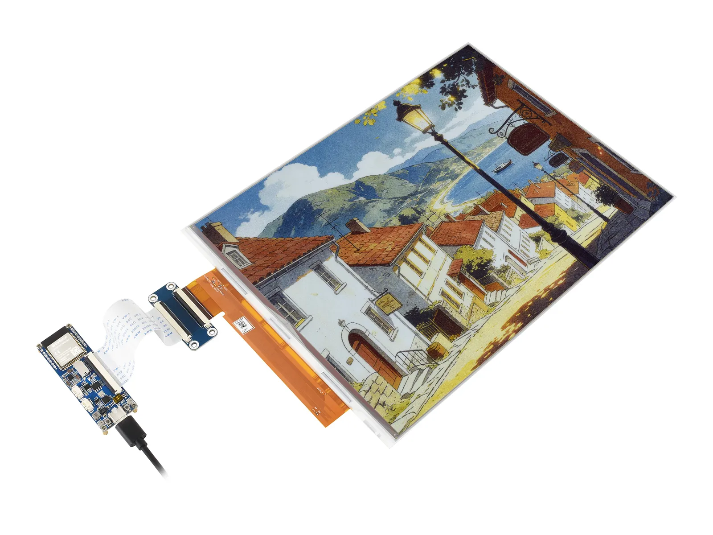

# 微雪 ESP32-S3-ePaper-13.3E6

[English](README.md)

ESP32-S3-ePaper-13.3E6 是一款面向 13.3 英寸、1600 × 1200 分辨率六色电子墨水屏设计的开发板。板载 ESP32-S3，支持 2.4 GHz Wi-Fi 和 蓝牙 5 (LE)，并集成音频、RTC、TF 卡、USB Type-C 及电池相关功能，适用于无线相框、信息展示牌、智能显示终端和其他低功耗物联网应用。

- [购买链接](https://www.waveshare.net/shop/ESP32-S3-ePaper-13.3E6.htm)
- [产品文档](https://www.waveshare.net/wiki/ESP32-S3-ePaper-13.3E6)



## 仓库结构

本仓库提供 ESP32-S3-ePaper-13.3E6 的示例程序、出厂固件和 SD 卡资源。

```text
.
├── example/         # ESP-IDF 和 Arduino 示例程序
├── Firmware/        # 出厂固件（.bin）
├── SD_files/        # SD 卡图片、音频和网页资源
└── assets/          # 文档使用的图片
```

## 快速开始

预编译的出厂固件位于 [`Firmware/`](Firmware)，所需的 SD 卡资源位于 [`SD_files/`](SD_files)。有关开发环境搭建、固件烧录、引脚定义和配置方法，请参阅 [产品文档](https://www.waveshare.net/wiki/ESP32-S3-ePaper-13.3E6)。

## 参与贡献

欢迎参与贡献！您可以通过以下方式提供帮助：

1. Fork 本仓库。
2. 为新功能或问题修复创建分支。
3. 提交更改，并提供清晰的说明。
4. 提交 Pull Request 以供审核。

## 问题与支持

如有问题，请提交包含详细信息的 [Issue](https://github.com/waveshareteam/ESP32-S3-ePaper-13.3E6/issues)，或联系微雪团队并提供订单号以获取技术支持。

## 许可证

本项目采用 Apache License 2.0 许可证，详情请参阅 [LICENSE](LICENSE) 文件。

---

感谢您使用微雪电子产品！
